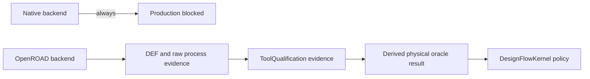

# PhysicalDesignEngine capability report

## Native capability

| Stage | Deterministic native behavior | Claim boundary |
|---|---|---|
| Floorplan | Die/core, rows, tracks, pads, power structures | Geometry smoke |
| Placement | Row legalization, blockage/core/overlap proof, DBU wirelength objective | Geometry smoke |
| CTS | Buffers, branch connectivity, routes, vias, DBU route limits | Geometry smoke; optional characterized PS estimate |
| Routing | Manhattan candidates, directional layers, vias, native conflict evidence | Geometry smoke |
| ECO | Typed cell/net/blockage mutations and repair proof | Candidate only |
| Antenna / DFM | Jumper/fill/redundant-via/hotspot candidates | Candidate only |

Every completed native stage emits canonical JSON, DEF, design diff, and run manifest artifacts with SHA-256 and byte-count metadata. This is reproducible construction evidence, not foundry signoff.

## Timing capability

CTS timing is available only when `PhysicalDesignClockTimingModelReference` binds exact model, PDK, RC, Liberty, process version, and corner artifacts. Samples must be monotonic, interpolation stays inside the characterized range, and every inserted cell master requires a retained delay. Without those artifacts, geometry may complete but timing remains blocked.

Placement wirelength, congestion, antenna ratio, and native repair metrics are review metrics. They are not STA, crosstalk, DRC, LVS, PEX, density, or foundry-rule verdicts.

## Interchange

| Format | Input | Output | Status |
|---|---:|---:|---|
| Canonical JSON | Yes | Yes | Native canonical state |
| Supported DEF subset | Yes | Yes | Deterministic parser/writer with diagnostics |
| GDSII | No | No | Dedicated standard mask-data library required |
| OASIS | No | No | Dedicated standard mask-data library required |

PhysicalDesignEngine exposes no GDSII/OASIS serialization seam. The host flow
composes a dedicated standard mask-data library and qualifies the concrete
exporter through ToolQualification before release policy accepts its output.

## Production eligibility

The native implementation supports `geometrySmoke` and CTS `characterizedTiming`; it does not support `productionImplementation`.

The OpenROAD implementation supports `productionImplementation` as a callable external process contract. It consumes exact executable, Verilog, SDC, LEF, Liberty, RC setup, PDK, corner, and stage-script identities and emits a standard DEF plus raw evidence. This is tool execution capability, not self-issued production eligibility.

The engine can emit raw corpus, implementation, and correlation artifacts for a
future external backend. ToolQualification verifies their bytes and evaluates
trust; the engine does not issue qualification or release approval.

DRC, LVS, PEX, Timing, EM/IR, ERC/ESD/latch-up, and release engines remain independent authorities.
