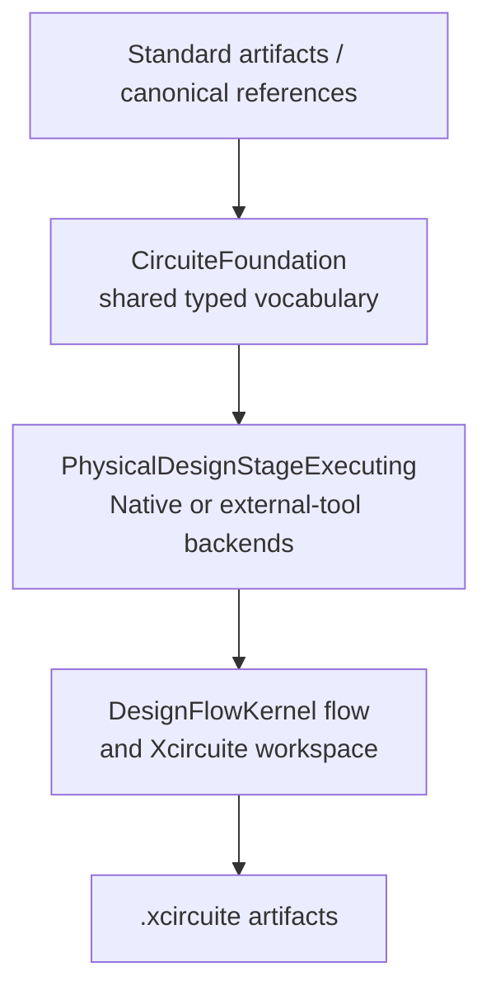

# PhysicalDesignEngine Design

## Purpose

Floorplan, placement, CTS, routing, ECO, antenna repair and DFM mutation contracts.

## Responsibility boundary

This package owns the schemas and engine protocols listed in its public products. It must remain usable without UI state and without the Xcircuite runtime.

## Non-responsibilities

- Final DRC, density or antenna verdicts
- Parasitic extraction
- Tapeout stream-out approval

## Dependency direction

`CircuiteFoundation` is the dependency floor for cross-engine concepts. Engine,
artifact, diagnostic and evidence contracts are expressed through Foundation
types; run lifecycle and workspace persistence remain in their owning packages.

Backends may depend on lower-level data packages. This package must never import `Xcircuite` or `circuit-studio`.

## Trust model

Kernel availability, corpus validation, oracle correlation, process-scoped qualification and release approval are distinct states. The package reports capability and evidence; Xcircuite and ToolQualification apply flow policy.

## Artifact requirements

All outputs are immutable run artifacts with role, format, digest and the input design/PDK revision needed to reproduce the result.

The filesystem artifact store uses `ArtifactLocation` for workspace-relative
resolution and creates a new path with a collision-safe temporary-file move.
An existing path is never replaced. Artifact references are created directly
with verified digest and byte-count metadata.

Human approval is a second integrity boundary: resume first validates the
decision identity, then re-reads the current manifest and all artifacts and
compares the embedded manifest, proposed/base revisions, diff, digest map and
decision scope with the reviewed packet.
