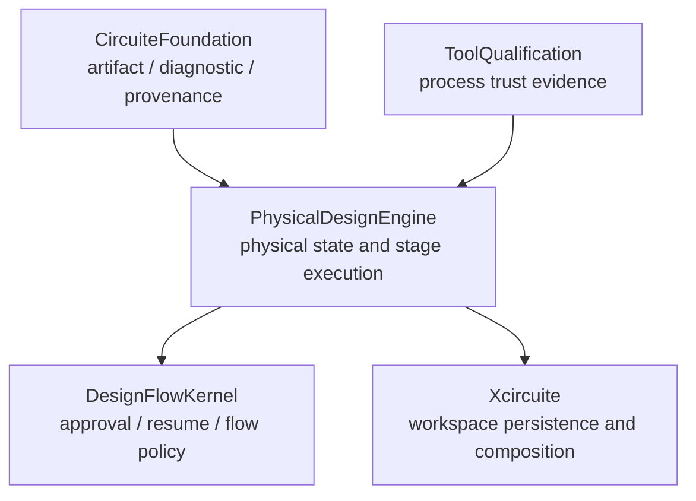
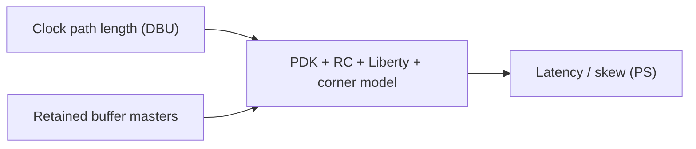

# PhysicalDesignEngine Design

## Purpose

PhysicalDesignEngine owns typed physical-design state, stage protocols, deterministic native geometry mutations, and evidence needed to review those mutations. It remains usable without UI state or the Xcircuite runtime.

## Responsibility boundary

PhysicalDesignEngine owns:

- canonical `PhysicalDesignSnapshot` geometry and implementation proof state;
- direct `Engine`-conforming stage protocols;
- immutable JSON/DEF/diff/manifest output;
- PDK/RC/Liberty/corner-bound clock timing estimates;
- physical oracle-correlation records consumed with ToolQualification evidence.

It does not own:

- tool qualification or production eligibility issuance;
- flow approval, release policy, or run lifecycle;
- final DRC, LVS, PEX, timing, density, antenna, EM/IR, or tapeout verdicts;
- a concrete GDSII/OASIS implementation.

## Three execution meanings

| Layer | Inputs | Output claim |
|---|---|---|
| Geometry smoke | Canonical snapshot and deterministic configuration | Geometry invariants only |
| Characterized CTS | Geometry plus exact PDK/RC/Liberty/corner model artifacts | Clock timing estimate for that retained model |
| Production backend | Canonical ToolQualification process evidence rebuilt from raw corpus/oracle/health results | Eligibility may be evaluated by host policy; native backend remains blocked |

`characterizedTiming` and `productionEligible` are intentionally separate. A valid RC/cell model can support a timing estimate without proving the placement/routing algorithm, rule deck, executable, corpus, or oracle correlation.

## Dimensional model

Geometry fields use database units (`DBU`). Time fields use picoseconds (`PS`) and appear only in `PhysicalDesignClockTimingEstimate`.

The native CTS algorithm never compares DBU distance with a picosecond target and never derives time by copying a path length. Wire-delay samples must increase in path length without decreasing delay. Interpolation is bounded to the retained characterization range; extrapolation and missing cell delays are typed errors.

## Production trust boundary

PhysicalDesignEngine emits revisions, diffs, implementation identity, and raw
correlation artifacts. ToolQualification reads those immutable artifacts and
owns tool trust. The package neither reconstructs a trust record nor evaluates
approval or release policy.

## Artifact safety

All artifact locations are workspace-relative. The filesystem store resolves the configured root canonically, checks each parent and leaf against that root, rejects symlink traversal, verifies byte count and SHA-256 on read, and uses immutable destination paths on write.

Review/resume helpers in this package validate physical revision identity and current bytes. DesignFlowKernel remains the owner of the approval decision and lifecycle transition that consumes those checks.

## Foreign format boundary

`PhysicalDesignMaskDataEncoder` is a serialization protocol for concrete mask-data libraries. Implementations conform directly. Qualification is evaluated by ToolQualification and host flow policy; the encoder protocol contains no qualification state or self-approval gate.
