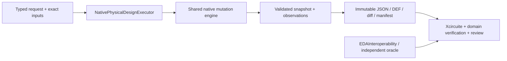

# PhysicalDesignEngine Design

## Purpose and Scope

PhysicalDesignEngine owns canonical physical state, native stage execution, and
immutable raw observations. Its current scope is deterministic geometry smoke and
characterized CTS, not production physical closure. The system ownership contract
is [LSI AGENTS.md](../AGENTS.md). Products and modules follow [Package.swift](Package.swift).

## Responsibilities and Boundaries

The package owns floorplan, power geometry, placement, CTS, routing, ECO, antenna,
fill, via and hotspot mutations; request validation; JSON/DEF interchange; and
artifact provenance. `PhysicalDesignEngine` and each stage wrapper delegate to
`NativePhysicalDesignExecutor`, which validates inputs, invokes the shared
`PhysicalDesignNativeMutationEngine`, and persists verified immutable outputs.

OpenROAD compatibility execution belongs to EDAInteroperability. PhysicalDesignEngine
neither invokes OpenROAD nor substitutes it for missing native production semantics.
ToolQualification owns tool trust; DesignFlowKernel owns approval and resume;
Xcircuite owns workspace composition. DRC, LVS, PEX and timing signoff remain with
their domain engines. Standard mask encoding belongs to swift-mask-data and its
layout integration.

## Related Designs

| Design | Relationship | Contract Used | Summary | Cautions |
|---|---|---|---|---|
| [LSI architecture](../docs/platform-architecture.md) | parent system architecture | Native-primary platform ownership | Independent domain engines compose through Xcircuite | Smoke completion does not prove platform completion |
| [CircuiteFoundation](../CircuiteFoundation/DESIGN.md) | depends on | Artifact identity, diagnostics, provenance | Shared cross-domain contracts | Content identity is separate from availability |
| [LogicDesign](../LogicDesign/DESIGN.md) | depends on | Logic design reference | Exact logical input identity | Preserve input digest binding |
| [PDKKit](../PDKKit/DESIGN.md) | depends on | PDK reference | Exact process input identity | Geometry models do not prove foundry qualification |
| [EDAInteroperability](../EDAInteroperability/DESIGN.md) | coordinates with | DEF compatibility | External execution and import live outside this package | An oracle does not replace the native implementation |
| [DesignFlowKernel](../DesignFlowKernel/DESIGN.md) | used by through Xcircuite | Engine results and artifacts | Host approval and resume | The package cannot issue approval or release authorization |

## Architecture


```mermaid
flowchart LR
  Request["Typed request + exact inputs"] --> Executor["NativePhysicalDesignExecutor"]
  Executor --> Mutation["Shared native mutation engine"]
  Mutation --> State["Validated snapshot + observations"]
  State --> Store["Immutable JSON / DEF / diff / manifest"]
  Store --> Host["Xcircuite + domain verification + review"]
  External["EDAInteroperability / independent oracle"] --> Host
```

## Contracts and Invariants

Request schema 5 rejects legacy schema values. Exactly one initial snapshot or
retained layout supplies the physical state. A completed mutation must pass snapshot
validation; blocked mutations publish no successful revision. Geometry, timing and
production claims remain distinct. `productionImplementation` fails with
`native_production_implementation_unsupported` until native production behavior is
implemented and verified; no caller flag or external backend may bypass this gate.

Geometry uses DBU. Timing estimates use PS only with verified PDK/RC/Liberty/corner
characterization; missing models and extrapolation fail explicitly.

Routing checks every segment against other nets on that segment's actual layer.
Coincident geometry on different layers is not a same-layer spacing violation.
Re-routing replaces both routes and vias for the selected nets and preserves
unselected nets. Every generated inter-layer bend retains its newly generated via,
even when the preceding snapshot used the same via ID. Routing evidence must describe
the retained output, not connections discarded during replacement.

DEF decoding keeps each supported `+ ROUTED` clause's points on its declared layer;
coordinates from later clauses cannot create connecting or zero-length segments.
The supported DEF subset is not a lossless execution-state serialization: cell pin
positions and abstract via state are not fully represented. JSON remains the full
execution-state artifact; DEF route-geometry round trips do not prove via or
foundry connectivity.

## Runtime Flows

```text
API / CLI / stage wrapper -> validation -> load exact snapshot -> native mutation
    -> validate output -> immutable JSON / DEF / diff / manifest -> domain verification
```

Cancellation is checked before mutation and within routing. Blocked or cancelled
mutations cannot become successful revision artifacts. A subsequent stage consumes
an exact retained state rather than an implicit latest revision.

## State, Ownership, and Lifecycle

Mutation state and DEF parser state are invocation-local values. No new shared
mutable state or target-dependent isolation is introduced. The memory artifact
store owns its dictionary in an actor; the filesystem store owns root containment,
immutable paths, digest/byte verification, and symlink rejection. Host run lifetime
and shutdown remain outside the native mutation engine.

## Failure, Concurrency, and Constraints

Malformed configuration, ambiguous inputs, invalid snapshots, routing blockages,
same-layer spacing conflicts, incomplete nets and unsupported fidelity produce
structured failures. Per-request configuration owns route width/spacing, allowed
layers, geometry and repair constraints. Existing deterministic Manhattan routing
is a limited native algorithm; it does not establish timing-driven or foundry-rule
closure. WASM and Embedded execution are not claimed by this Foundation-based
macOS package or by macOS-only verification evidence.

## Verification and Change Impact

[NativeExecutionTests](Tests/PhysicalDesignEngineTests/NativeExecutionTests.swift)
owns behavioral routing verification: reject same-layer vertical overlap, accept
different-layer crossing, preserve vias from global through detailed routing, and
reopen the actual retained multilayer DEF without geometry/layer corruption.
The existing package tests cover stage prerequisites, negative inputs, cancellation,
immutable artifacts, review packets, characterized CTS and CLI failures.
[ProductionEvidenceTests](Tests/PhysicalDesignEngineTests/ProductionEvidenceTests.swift)
owns native production rejection and the release-authority boundary.

Routing changes affect global/detailed routing and ECO re-routing through the same
shared function. DEF changes affect stored output and EDAInteroperability import.
Verify the affected behavioral tests, then the non-Metal SwiftPM package with a
process timeout. Platform signoff and independent process qualification require
separate evidence; package tests cannot establish them.
