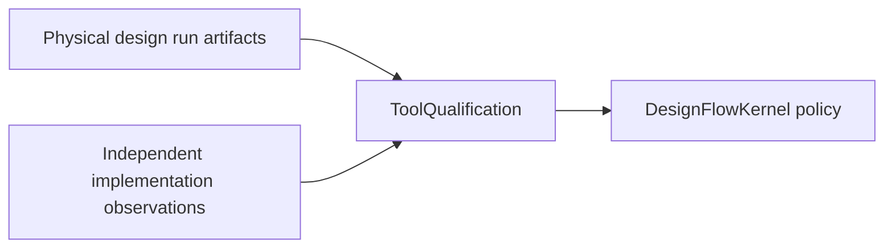

# PhysicalDesignEngine Interface Contract

## Engine boundary

```swift
public protocol PhysicalDesignStageExecuting: Engine
where Request == PhysicalDesignRequest,
      Output == PhysicalDesignResult {}
```

`FloorplanExecuting`, `PlacementExecuting`, `CTSExecuting`, `RoutingExecuting`, `PhysicalECOExecuting`, and `PhysicalDFMExecuting` refine `Engine` directly with the same request and result types. No compatibility envelope or bridge layer is required.

`PhysicalDesignResult` directly conforms to `ArtifactProducing`, `DiagnosticReporting`, and `EvidenceProviding`. Its Foundation fields are:

- `[ArtifactReference]` for immutable outputs;
- `[DesignDiagnostic]` for structured failures and limitations;
- `ExecutionProvenance` for producer, invocation, inputs, configuration digest, design revision, seed, and timing;
- `PhysicalDesignPayload` for domain data and capability claims.

## Request

`PhysicalDesignRequest` schema version 2 requires `executionIntent` and carries:

| Field | Meaning |
|---|---|
| `inputs` | Exact retained execution inputs |
| `design` | Mapped logic design identity |
| `constraints` | Timing constraint artifact and modes |
| `pdk` | Exact PDK manifest, process, version, and digest |
| `initialSnapshot` / `inputLayout` | Exactly one canonical physical input |
| `configuration` | Deterministic geometry controls and seed |
| `clockTimingModel` | Optional PDK/RC/Liberty/corner characterization binding |
| `productionEvidence` | Optional ToolQualification and physical-correlation artifact references |

Older request and payload schemas are not decoded through compatibility defaults.

## Claims

`PhysicalDesignCapabilityClaims` reports independent geometry, timing, and production claim states. The native backend emits:

| Situation | Geometry | Timing | Production |
|---|---|---|---|
| Ordinary geometry stage | verified | not applicable | blocked |
| CTS without characterization | verified | blocked | blocked |
| CTS with verified characterization | verified | verified | blocked |
| Native production request | blocked | blocked | blocked |

## Clock timing model

`PhysicalDesignClockTimingModelReference` binds the model JSON, PDK manifest, RC model, Liberty library, process/version, and corner. `LocalPhysicalDesignClockTimingModelLoader` re-reads all four artifacts and verifies their exact digest and byte count before decoding.

`PhysicalDesignSnapshot.ClockTree` stores path lengths in DBU. Optional `PhysicalDesignClockTimingEstimate` stores latency/skew in PS with model and source digests. Geometry fields are never repurposed as time.

## Production-observation boundary



Raw observations retain:

- distinct backend and oracle executable identities and bytes;
- exact PDK/process/deck binding;
- retained, byte-verified corpus inputs and separate backend/oracle outputs;
- a correlation artifact retained in ToolQualification oracle evidence;
- exact RC/Liberty/corner binding when a clock timing model is requested.

ToolQualification verifies and evaluates those inputs. PhysicalDesignEngine does
not consume or issue a trust verdict, approve a run, or authorize release.

## Canonical outputs

A completed native mutation emits `revision.json`, `revision.def`, `design-diff.json`, and `run-manifest.json`. Every reference includes a workspace-relative location, role, kind, format, SHA-256 digest, and byte count. The run manifest binds request intent, timing-model reference, claims, implementation configuration, base/proposed revisions, and design diff.

## Mask-data encoding

`PhysicalDesignMaskDataEncoder` is the foreign serialization protocol for a concrete GDSII/OASIS library:

```swift
public protocol PhysicalDesignMaskDataEncoder: Sendable {
    var supportedFormat: ArtifactFormat { get }
    var implementationID: String { get }
    func encode(_ snapshot: PhysicalDesignSnapshot) async throws -> Data
}
```

The protocol contains no qualification state. ToolQualification and host policy validate a concrete encoder before invocation.

## Error contract

- Missing semantics or insufficient trust returns a `blocked` result with typed diagnostics.
- Persistence failure returns `failed` only when a valid result cannot be committed.
- Cancellation remains `cancelled`.
- Model, production-evidence, artifact-store, and review/resume failures use typed errors.
- Errors are never suppressed with `try?`.
