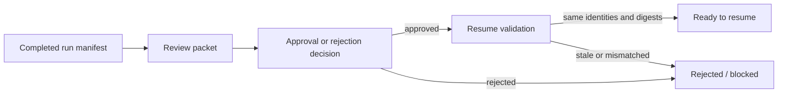

# PhysicalDesignEngine Interface Contract

## Common shape

```swift
public protocol DomainExecuting: Sendable {
    func execute(
        _ request: DomainRequest
    ) async throws -> PhysicalDesignResult
}
```

Requests carry a schema version, run ID and typed Foundation artifact references. Payloads contain domain metrics only; diagnostics, artifacts and provenance are fields of `PhysicalDesignResult`.

## CircuiteFoundation boundary

```swift
public protocol PhysicalDesignStageExecuting: Engine
where Request == PhysicalDesignRequest,
      Output == PhysicalDesignResult {}
```

`PhysicalDesignStageExecuting` directly refines the Foundation `Engine`
contract. Each result includes immutable artifact references, diagnostics and
execution provenance; no compatibility envelope or adapter is required.

`PhysicalDesignFoundationEvidence` provides the same evidence and diagnostic
surface independently of the execution result. `PhysicalDesignRequest` also
exposes a stable root-cell `DesignObjectReference`.

## Products

### PhysicalDesignCore

Shared physical-design request, canonical snapshot, immutable layout reference, artifact store, metrics and design-diff contract.

### FloorplanEngine

Floorplan and power planning.

### PlacementEngine

Global and detailed placement.

### CTSEngine

Clock-tree synthesis.

### RoutingEngine

Global and detailed routing.

### PhysicalECO

Timing, DRC and antenna repair.

### PhysicalDFM

Fill, redundant via and manufacturability mutation.

### PhysicalDesignEngine

Umbrella API. `PhysicalDesignEngine` dispatches the request stage to the deterministic native implementation and returns `PhysicalDesignResult`.

### Canonical input and output

`PhysicalDesignRequest` accepts either `initialSnapshot` or `inputLayout`, never both. Native execution reads canonical JSON or the supported DEF subset. A completed mutation emits:

| Artifact | Format | Purpose |
|---|---|---|
| `revision.json` | JSON | Canonical immutable physical snapshot |
| `revision.def` | DEF | Standard layout handoff for supported native output |
| `design-diff.json` | JSON | `PhysicalDesignDesignDiff` for human review and Agent resume |
| `run-manifest.json` | JSON | Provenance binding for the complete physical-design transaction |

Each output reference records role, format, digest and byte count. Run identity
is carried by the containing manifest and execution provenance.

`PhysicalDesignMaskDataAdapter` is the protocol boundary for future GDSII/OASIS adapters. `PhysicalDesignMaskDataAdapterGate` requires a matching format and explicit process qualification before invoking an adapter.

`PhysicalDesignSnapshot.implementationState` is the canonical evidence surface for M3. It carries generated tracks, power domains, pads, placement proof, clock route constraints and routing evidence. These fields are included in JSON revisions and `PhysicalDesignDesignDiff`; the run manifest also records the implementation configuration used to produce them.

M4 repair requests use `PhysicalDesignConfiguration.repairConstraints`. A completed repair appends `PhysicalDesignImplementationState.RepairProof`; when verification is required and native post-repair checks find a violation, the executor returns `blocked` and writes no immutable revision.

### Review and resume boundary

`PhysicalDesignReviewGating` is the protocol-first approval boundary for immutable native results:



`PhysicalDesignReviewGate.prepareReview` reads the manifest and all manifest artifacts through the injected `PhysicalDesignArtifactStore`. It verifies artifact bytes, SHA-256 digests, byte counts, the proposed layout digest and the design-diff binding before returning `PhysicalDesignReviewPacket`. `evaluate` returns `approved`, `rejected` or `blocked`. `validateResume` returns `readyToResume` only when the approval is bound to the same run ID, stage, manifest digest, proposed layout digest, optional base layout digest and complete decision scope. The packet and decision are Codable artifacts; a host workspace may persist them through its run ledger.


## Error contract

- Throw only when execution cannot produce a valid result envelope.
- Represent design findings and failed checks as typed diagnostics and a completed domain payload.
- Represent missing prerequisites or insufficient semantics as `blocked`.
- Preserve cancellation as `cancelled`.
- Do not swallow parser, process or persistence failures.

## Composition

Xcircuite invokes `PhysicalDesignStageExecuting` directly and persists returned
artifacts in its workspace store. DesignFlowKernel owns flow status, approval,
resume and scheduling; ToolQualification owns capability and trust decisions.
