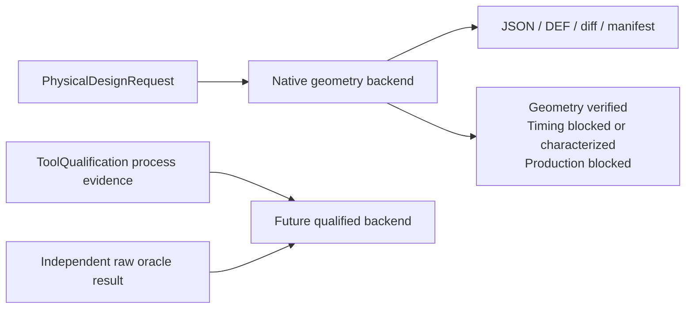

# PhysicalDesignEngine

Protocol-first floorplan, placement, clock-tree, routing, ECO, antenna-repair, and DFM contracts for Swift.

## Status

The package contains a deterministic native geometry backend over `PhysicalDesignSnapshot`. It is suitable for reproducible development, review, and smoke testing. It is not a production place-and-route implementation and cannot promote itself to production eligibility.



## Products

| Product | Responsibility |
|---|---|
| `PhysicalDesignCore` | Canonical snapshot, request/result, artifact I/O, timing characterization, production-evidence consumer |
| `FloorplanEngine` | Floorplan and power planning protocol |
| `PlacementEngine` | Global and detailed placement protocol |
| `CTSEngine` | Clock-tree synthesis protocol |
| `RoutingEngine` | Global and detailed routing protocol |
| `PhysicalECO` | Physical ECO protocol |
| `PhysicalDFM` | DFM mutation protocol |
| `PhysicalDesignEngine` | Native stage dispatcher |
| `PhysicalDesignCLISupport` / `physical-design` | Structured JSON CLI |

## Execution contract

Every stage executor conforms directly to the `CircuiteFoundation.Engine` contract and returns `PhysicalDesignResult`. Results expose Foundation `ArtifactReference`, `DesignDiagnostic`, and `ExecutionProvenance` values without a compatibility envelope or bridge layer.

`PhysicalDesignRequest.executionIntent` distinguishes three meanings:

| Intent | Native support | Meaning |
|---|---:|---|
| `geometrySmoke` | Yes | Deterministic geometry construction and native invariant checks |
| `characterizedTiming` | CTS only | Clock timing derived from a retained PDK/RC/Liberty/corner model |
| `productionEligible` | No | Always blocked by the native backend |

Geometry remains in database units. `shortestPathLengthDBU`, `longestPathLengthDBU`, route constraints, and placement wirelength objectives never contain picoseconds. Clock latency and skew are emitted only as `PhysicalDesignClockTimingEstimate` after exact model, PDK, RC, cell-library, and corner artifacts have been re-read and verified. Missing characterization still permits geometry smoke output, but timing and production claims remain blocked.

## Artifacts and trust

Completed native mutations emit immutable artifacts:

| Artifact | Format | Purpose |
|---|---|---|
| `revision.json` | JSON | Canonical physical snapshot |
| `revision.def` | DEF | Supported standard interchange subset |
| `design-diff.json` | JSON | Human/Agent review surface |
| `run-manifest.json` | JSON | Input, configuration, implementation, and revision binding |

Both artifact stores verify byte count and SHA-256. The filesystem store enforces a canonical workspace root, rejects absolute paths and symlink escapes, writes through a unique temporary file, and never replaces an immutable path.

Production trust is not issued or evaluated by this package. The engine emits
byte-bound run, corpus, implementation, and correlation artifacts;
ToolQualification consumes those raw records. Human approval, flow transition,
resume, and release policy remain outside the engine. A characterized CTS result
is not production qualification.

GDSII/OASIS stream-out is not part of this package's public execution
contract. A host composes the canonical physical result with a dedicated
standard mask-data library and evaluates that concrete exporter through
ToolQualification and release policy.

## Native limitations

The native backend does not claim foundry-rule correctness, signoff timing, DRC, LVS, PEX, EM/IR, or tapeout stream-out readiness. Native placement, routing, ECO, antenna, and DFM checks are deterministic construction checks and review candidates. Independent engines remain authoritative.

## CLI

From the repository root:

```bash
swift run physical-design --request Fixtures/positive-floorplan-request.json --project-root .
swift run physical-design --request Fixtures/negative-missing-snapshot-request.json --project-root .
```

The CLI emits one structured `PhysicalDesignResult` JSON value.

## Build and test

`Package.swift` selects each dependency independently. A sibling checkout is
used when its `Package.swift` exists; otherwise SwiftPM resolves the pinned
GitHub revision. This repository does not require an umbrella checkout.

| Dependency | Local sibling | Remote fallback revision |
|---|---|---|
| CircuiteFoundation | `../CircuiteFoundation` | `7abcac83517935c9b9f7553d7016d62cffde259d` |
| LogicDesign | `../LogicDesign` | `b9aa25b0b78e6168befa25df3bfe8309bd020a6d` |
| PDKKit | `../PDKKit` | `b62c5ad7e5819a24977038c2133856caed52f481` |

```bash
perl -e 'alarm shift; exec @ARGV' 30 xcodebuild \
  -scheme PhysicalDesignEngine-Package \
  -destination 'platform=macOS' \
  build CODE_SIGNING_ALLOWED=NO

perl -e 'alarm shift; exec @ARGV' 30 xcodebuild \
  -scheme PhysicalDesignEngine-Package \
  -destination 'platform=macOS' \
  test CODE_SIGNING_ALLOWED=NO
```

The regression suite covers all native stages, dimensional CTS behavior, characterized timing, native production blocking, ToolQualification evidence consumption, independent oracle correlation, immutable artifact verification, symlink escape rejection, review packet artifact integrity, DEF interchange, and CLI errors.

See `DESIGN.md`, `INTERFACES.md`, `CAPABILITY.md`, and `GOAL_STATUS.md` for exact responsibility and maturity boundaries.
