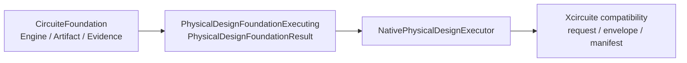

# PhysicalDesignEngine

Floorplan, placement, CTS, routing, ECO, antenna repair and DFM mutation contracts.

## Status

The package provides a deterministic native backend over the canonical `PhysicalDesignSnapshot` JSON IR. It accepts canonical JSON and the supported DEF interchange subset, emits immutable JSON and DEF revisions, records line/section-aware parser diagnostics, persists physical implementation proof evidence, and exposes a headless Xcircuite stage adapter. Process-specific qualification and GDSII/OASIS stream-out remain explicit external boundaries.

## Products

| Product | Responsibility |
|---|---|
| `PhysicalDesignCore` | Canonical snapshot, request, immutable layout reference and run manifest |
| `FloorplanEngine` | Floorplan and power planning |
| `PlacementEngine` | Global and detailed placement |
| `CTSEngine` | Clock-tree synthesis |
| `RoutingEngine` | Global and detailed routing |
| `PhysicalECO` | Timing, DRC and antenna repair |
| `PhysicalDFM` | Fill, redundant via and manufacturability mutation |
| `PhysicalDesignEngine` | Umbrella API |
| `PhysicalDesignCLISupport` / `physical-design` | Deterministic JSON CLI |

## Contract

Every executing product uses:

- a `Codable`, `Hashable`, `Sendable` request conforming to `XcircuiteEngineRequest`;
- `XcircuiteEngineResultEnvelope<Payload>` for status, diagnostics, artifacts and execution metadata;
- protocol-first dependency injection;
- immutable `XcircuiteFileReference` inputs and outputs;
- explicit blocked, failed and cancelled states.

Native execution additionally uses:

- `PhysicalDesignSnapshot` as the canonical, UI-independent physical state;
- `PhysicalDesignArtifactStore` for dependency-injected immutable artifact I/O;
- `PhysicalDesignDiffBuilder` for reviewable `XcircuiteDesignDiff` artifacts;
- `PhysicalDesignConfiguration` for typed, deterministic stage controls.

### CircuiteFoundation boundary

`CircuiteFoundation` is the shared cross-engine vocabulary and is the direct
dependency of `PhysicalDesignCore`. The migration is additive: the existing
Xcircuite request/result and run-manifest models remain at the compatibility
boundary until the sibling runtime changes its ledger contract.



The public migration seam is `PhysicalDesignFoundationExecuting`. Its result
projects only output artifacts that already have verified SHA-256 and byte
count metadata into `ArtifactReference`, maps diagnostics into
`DesignDiagnostic`, and records `ExecutionProvenance` in
`EvidenceManifest`. `PhysicalDesignFoundationEvidence` is the standalone
evidence view for coordinators and agents. Missing integrity metadata is a
typed boundary error; it is never guessed or silently repaired.

Artifact paths are immutable. Both artifact stores reject an existing path,
and the filesystem store commits through a collision-safe temporary-file move.
Approval resume uses `validateResumeAgainstCurrentArtifacts` to re-read the
manifest and every referenced artifact immediately before resume, including
the embedded manifest and digest map.

The native backend supports canonical JSON and DEF input and emits canonical JSON plus deterministic DEF. The supported DEF subset covers design units, die area, rows, components, top-level pins, net connections, routed segments, placement blockages and power structures. Power planning materializes declared power-net source/sink connectivity, rings, straps, rails and checked vias. CTS materializes clock branch routes and vias in addition to buffer cells and constraints. Unsupported opaque layout formats return `blocked` with a structured diagnostic; no native result claims DRC, LVS, PEX, timing, GDSII, OASIS, or foundry qualification.

Native M3 execution records tracks, power domains, IO pads, placement legalization proof, CTS branch connectivity and routing evidence in `PhysicalDesignSnapshot.implementationState`. M4 repair stages additionally persist verified repair proofs. Placement, routing and repair verification fail closed on physical conflicts; timing objectives and antenna risk remain review metrics for independent signoff oracles.

M5 provides `PhysicalDesignReviewGating` for human-in-the-loop control. It builds a Codable review packet from a completed immutable run manifest, rechecks every referenced artifact digest, evaluates an approval or rejection decision, and validates resume identity against the same run, stage, manifest, proposed revision, base revision and decision scope. The async resume gate revalidates current artifact bytes and the embedded manifest after approval. Rejected, stale or tampered revisions return structured blocked diagnostics; the native backend never mutates an existing immutable revision during review.

GDSII/OASIS integration is protocol-first through `PhysicalDesignMaskDataAdapter`. `PhysicalDesignMaskDataAdapterGate` rejects adapters without process qualification, so an external implementation remains blocked until its qualification evidence is supplied.

## Xcircuite integration

Xcircuite owns the closure loop. Physical products emit immutable layout revisions; Xcircuite sends them to DRC, LVS, PEX and Timing, then constructs typed repair requests. Xcircuite persists the review packet and approval record in its run ledger, while `PhysicalDesignReviewGate` remains the native identity and artifact-integrity gate used before resume.

The library does not depend on the Xcircuite runtime. Xcircuite owns the adapter to `DesignFlowKernel.FlowStageExecutor`, artifact persistence, qualification gates, repair loops and human approval.

## Build

```bash
swift build
```

## CLI

```bash
swift run physical-design --request Fixtures/positive-floorplan-request.json --project-root .
swift run physical-design --request Fixtures/negative-missing-snapshot-request.json --project-root .
```

The command emits one JSON result envelope. Successful runs write `revision.json`, `revision.def`, `design-diff.json`, and `run-manifest.json` under `runs/<run-id>/physical-design/<stage>/`.

## Test

```bash
perl -e 'alarm 30; exec @ARGV' swift test
```

The current native regression suite covers JSON compatibility, DEF round trips, retained DEF fixtures, line/section diagnostics, DEF source provenance, all declared native stages, blocked prerequisites, stage boundaries, Foundation artifact/evidence conversion, artifact immutability, approval/resume identity, current-byte revalidation, physical connectivity mutations, overflow-safe validation and CLI error output. The 37-test suite passes with a timeout; the positive fixture completes with four immutable artifacts and the negative fixture is blocked with `physical_snapshot_missing`.

The Xcircuite adapter is verified from the sibling repository with:

```bash
swift test --scratch-path /tmp/lsi-xcircuite-physical-design --filter PhysicalDesignFlowStageExecutorTests
```

See [MILESTONES.md](MILESTONES.md) for the release/readiness path. M1 through the native M5 approval/resume slice are complete; M6, retained corpus and oracle correlation, is next.

See `DESIGN.md`, `INTERFACES.md`, `IMPLEMENTATION_PLAN.md`, and `CAPABILITY.md` for the boundary and qualification status.
